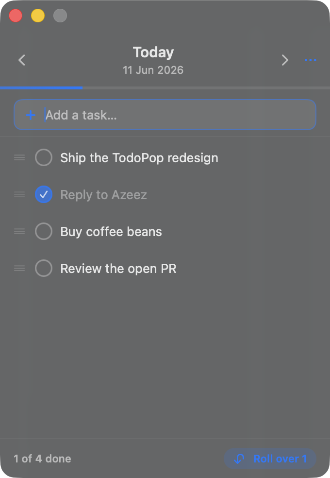

# TodoPop

A native macOS **menu bar** todo app. Click the menu bar item to open a panel; add, edit,
complete, reorder, and delete tasks; swipe between days; keep full history; and roll
unfinished tasks forward to today. The menu bar shows today's open-task count.

Built with SwiftUI (`MenuBarExtra`) + Swift Package Manager. No Xcode required — the
Command Line Tools toolchain is enough. Free, open source (MIT), dependency-free.

<p align="center"></p>

## Download

Grab the latest `TodoPop-vX.Y.Z.zip` from the [**Releases**](../../releases) page, unzip it,
and move **TodoPop.app** to `/Applications`. It lives in your menu bar — there's no Dock icon.

## Features

- **Menu bar item** with today's open-task count (`✓ 3`); hides the number at zero.
- **CRUD** — quick-add (Return), inline rename, completion toggle, delete (hover ✕, swipe,
  or ⌫). Renaming a task to empty deletes it.
- **Reorder within a day** — drag the `≡` handle on the left of a row (rows reflow live), or
  right-click → Move Up / Move Down. (A dedicated handle is used instead of `List` drag so the
  inline text field can't swallow the grab inside the menu bar popover.)
- **Day navigation** — chevrons, horizontal **swipe** on the header, or **⌘[ / ⌘]**.
  A **"Today" pill** (⌘T) appears when you're off today. Content slides in the travel
  direction.
- **History** — every task is bucketed by day and persisted; navigate to any past/future day.
- **Move between days** — right-click a task → Move to Yesterday / Today / Tomorrow.
- **Roll over** — on Today, a "Roll over N" action pulls every unfinished task from earlier
  days into today.
- **Progress** — a slim day-completion bar under the header; footer shows "N of M done" or
  "All done".
- **iCloud sync** (Mac↔Mac) — ⋯ → "Sync via iCloud" stores the data file in iCloud Drive so
  it syncs across your Macs. A file watcher reloads live when another Mac changes it. See
  [Sync](#sync).
- Native vibrancy, animated checkboxes, hover states, light/dark automatically.

## Project layout

```
Sources/
  TodoPopKit/      Pure logic + JSON persistence (no UI). Unit-testable.
  TodoPopUI/       SwiftUI views (TodoPanelView is the public entry point).
  TodoPop/         The menu bar app — @main, MenuBarExtra, AppDelegate.
  TodoPopPreview/  Renders TodoPanelView in a window with seeded data (visual checks).
  TodoPopCheck/    Headless logic test runner (no XCTest in Command Line Tools).
Resources/Info.plist   LSUIElement = true (menu-bar-only, no Dock icon).
Makefile               build / test / bundle / run / relaunch.
```

### Why a JSON store instead of SwiftData?

v1 uses a JSON-file–backed `@Observable` store. It builds reliably under pure SwiftPM
(no Xcode) and its logic is fully testable headlessly. SwiftData is a clean future
migration once Xcode is in the loop.

## Sync

TodoPop keeps the data file in one of two places:

| Sync   | Location |
|--------|----------|
| off    | `~/Library/Application Support/TodoPop/todos.json` (local only) |
| on     | `~/Library/Mobile Documents/com~apple~CloudDocs/TodoPop/todos.json` (iCloud Drive) |

Toggle it in the ⋯ menu ("Sync via iCloud"). This is **Tier-1, free sync** — it needs no
Apple Developer account, no code signing, and no Xcode; macOS's iCloud Drive syncs the file
across any Mac signed into your Apple ID. The header shows a small ☁ glyph when sync is on.

How it behaves:
- **Enable** unions your current tasks with anything already in iCloud (nothing is lost).
- **Disable** writes your current tasks back to the local file.
- A directory watcher reloads the in-memory list when the file changes underneath the app
  (e.g. another Mac synced an edit), using a content diff so it never reacts to its own writes.
- **Data-loss guards:** the watcher never blanks a non-empty list from a transient/empty
  read (e.g. an iCloud placeholder mid-download), and seeding ignores a source that isn't
  valid JSON. On launch, the app nudges iCloud to download the file so the watcher can pick
  up real data.

Caveats (inherent to file-based sync):
- It is **last-writer-wins**. Editing on two Macs at the exact same time can leave an iCloud
  conflict copy (`todos 2.json`). Fine for one person moving between Macs.
- **Second-Mac first launch:** if iCloud hasn't finished downloading the file yet, give it a
  moment before adding tasks (the download nudge + watcher will fill it in). A robust fix
  (NSFileCoordinator / download-status) is part of the Tier-2 work below.
- It is **Mac↔Mac only** — not an iPhone app. True multi-device + iOS wants **CloudKit**
  (or SwiftData+CloudKit), which requires a paid Apple Developer account, code signing, and
  Xcode. That's the planned Tier-2 upgrade.

## Build & run

```sh
make run        # build release, assemble TodoPop.app, launch it (appears in menu bar)
make relaunch   # kill any running instance, rebuild, relaunch
make test       # run the headless logic tests (swift run TodoPopCheck)
make bundle     # just assemble TodoPop.app
make clean
```

Visual check of the UI without clicking the menu bar item:

```sh
swift run TodoPopPreview                       # mixed sample data
TODOPOP_SCENARIO=empty    swift run TodoPopPreview
TODOPOP_SCENARIO=alldone  swift run TodoPopPreview
TODOPOP_SCENARIO=otherday swift run TodoPopPreview
```

To quit the menu bar app: open the panel → ⋯ → Quit TodoPop (⌘Q).

## Keyboard

| Shortcut | Action            |
|----------|-------------------|
| Return   | Add task          |
| ⌘[ / ⌘]  | Previous/next day |
| ⌘T       | Jump to today     |
| ⌘Q       | Quit              |

## Contributing

Contributions welcome — see [CONTRIBUTING.md](CONTRIBUTING.md). The app is intentionally
dependency-free; keep logic in `TodoPopKit` and add a check in `TodoPopCheck` (`make test`).

## License

[MIT](LICENSE) © 2026 Shakeeb.

## Status

v1 + iCloud sync, bug-hunted and hardened for production: **64 headless checks pass** (CRUD,
ordering + stable tiebreak, drag-reorder + bounds-safety, rollover, move, sync seed/union/
toggle/persistence, external-reload, the live file-watcher, and the data-loss guards). The app
launches as a menu-bar `UIElement`, shows the live count, persists across launches, and all
UI states render.

Fixed during hardening: a **SIGTRAP crash** where the file-watcher's DispatchSource handlers
inherited `@MainActor` isolation and trapped on every write (now `@Sendable`); a drag-reorder
**stutter/misalignment** (local→global gesture coordinate space); the midnight day-rollover
mismatch; external title edits not refreshing a row; duplicate keyboard shortcuts; `reorder`
index safety; sort instability on ties; per-render `DateFormatter` allocation; `onDelete`
snapshot safety; lost-edit-on-close; the swipe gesture hijacking the header buttons; and the
iCloud blank/placeholder data-loss paths. See `BRAINSTORM.md` for design decisions.
